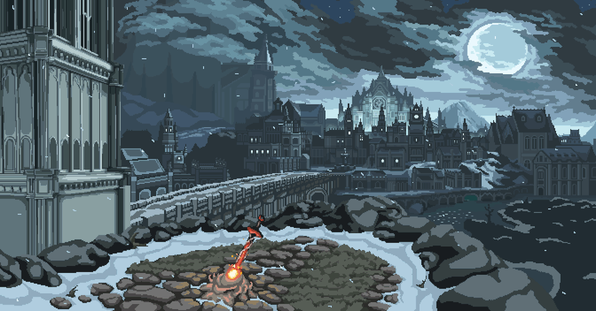

    

<h1 align="center">Hi 👋, I'm Shamir Rasul</h1>

    
    
    

    🔭 currently working on Upstaff Academy (LMS)  
    🌱 currently learning Docker, reactjs, Laravel  

<h2 align="center">⚒️ Tech Stack ⚒️</h2>

     
     
    

/*

<h2 align="center">⚡ Stats ⚡</h2>

    
    

*/
